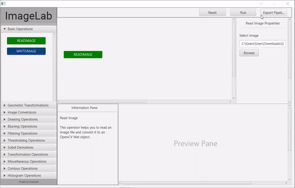

# ImageLab

[](https://opensource.org/licenses/Apache-2.0)
[](https://gitter.im/scorelab/ImageLab?utm_source=badge&utm_medium=badge&utm_campaign=pr-badge)
[![GitHub issues by-label][hacktoberfest-badge]][hacktoberfest-link]
  

### Introduction to the project:

ImageLab is a standalone tool which supports anyone to get started with image processing related concepts and techniques in an interactive, less logical way. So, this tool enables and also motivates the fresh users to understand how image processing concepts work by interacting with ImageLab. Moreover, for the users who are already comfortable with image processing tasks ImageLab offers a test environment before they move ahead with actual implementation or development.

#### Apache 2.0 Licence

See the [LICENSE](https://github.com/scorelab) file for details.



## Supported Image Processing Operations

- Basic Read/Write operation
- Image Conversion
- Image Smoothing
- Geometric Transformation operation
- Drawing operation
- Filtering operation
- Thresholding operation
- Transformation operations
- Contour operation
- Miscellaneous operation
- Histogram operation

## Project Documentation

Complete setup guidelines and other details can be found in the **[project documentation](https://scorelab.org/imagelab/)**.

### Technologies

You need to setup following technologies in order to run this project and start contribution.

| Technology   | Version              |
|--------------|----------------------|
|              |                      |
| Java         | 1.8                  |
| JavaFX       | 1.8 JDK (inbuilt)    |
| OpenCV       | 3.2.0                |
| Apache Maven | 3.6.3                |
| Ruby         | 3.6.3                |
| Jekyll       | 4.1.1                |


### Setup Guidelines

Cone the repository by pasting following command in your terminal.

```
git clone https://github.com/scorelab/ImageLab.git
```

Open the project in your preferred IDE. It will take a couple of minutes
to sync with the project related maven dependencies.

Then navigate to the project directory in terminal and type following command
to build the project.

```
mvn clean install
```

To skip tests and run the project.

```
mvn install -Dmaven.test.skip=true
```

Once the project build is successful, in order to execute the project run 
following command in the terminal.

```
mvn exec:java
``` 

Check the **[project documentation](https://scorelab.org/imagelab/)** for more instructions.


[<--# Generic Links -->]: #
[hacktoberfest-link]: https://github.com/scorelab/ImageLab/issues?q=is%3Aissue+is%3Aopen+label%3Ahacktoberfest
[hacktoberfest-badge]: https://img.shields.io/github/issues-raw/scorelab/ImageLab/hacktoberfest.svg?label=Hacktoberfest&color=purple
