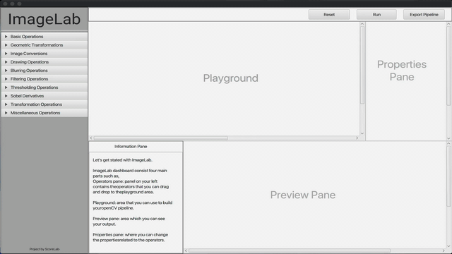

# ImageLab

[![GitHub issues by-label][hacktoberfest-badge]][hacktoberfest-link]
  

### Introduction to the project:

ImageLab is a standalone tool which supports anyone to get started with image processing related concepts and techniques in an interactive, less logical way. So, this tool enables and also motivates the fresh users to understand how image processing concepts work by interacting with ImageLab. Moreover, for the users who are already comfortable with image processing tasks ImageLab offers a test environment before they move ahead with actual implementation or development.

#### Apache 2.0 Licence

See the [LICENSE](https://github.com/scorelab) file for details.

## Project Documentation

### Technologies

You need to setup following technologies in order to run this project and start contribution.

| Technology   | Version              |
|--------------|----------------------|
|              |                      |
| Java         | 1.8                  |
| JavaFX       | 1.8 JDK (inbuilt)    |
| OpenCV       | 3.2.0                |
| Apache Maven | 3.6.3                |
| Ruby         | 3.6.3                |
| Jekyll       | 4.1.1                |

### Setup Guidelines

Follow this step-by-step guideline **[project documentation](https://scorelab.org/imagelab/)** to setup the project on your local PC.

[<--# Generic Links -->]: #
[hacktoberfest-link]: https://github.com/scorelab/ImageLab/issues?q=is%3Aissue+is%3Aopen+label%3Ahacktoberfest
[hacktoberfest-badge]: https://img.shields.io/github/issues-raw/scorelab/ImageLab/hacktoberfest.svg?label=Hacktoberfest&color=purple
